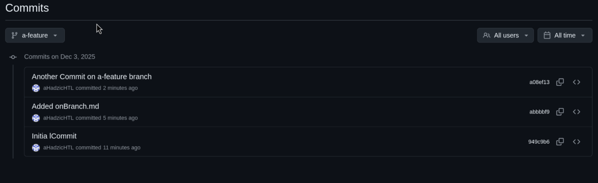
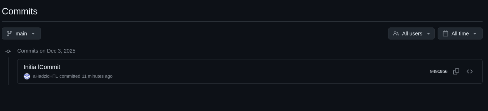
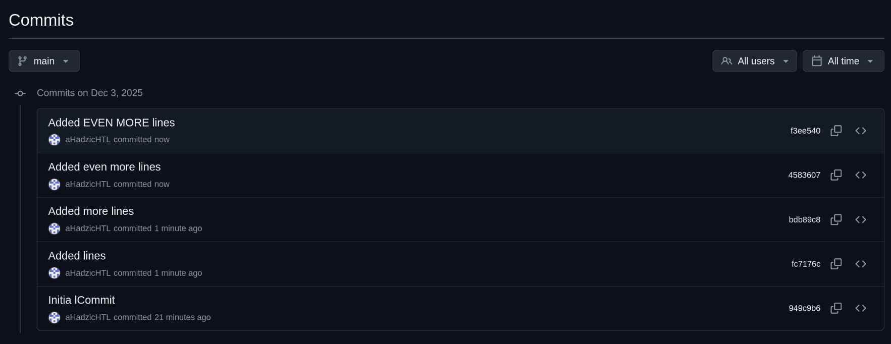
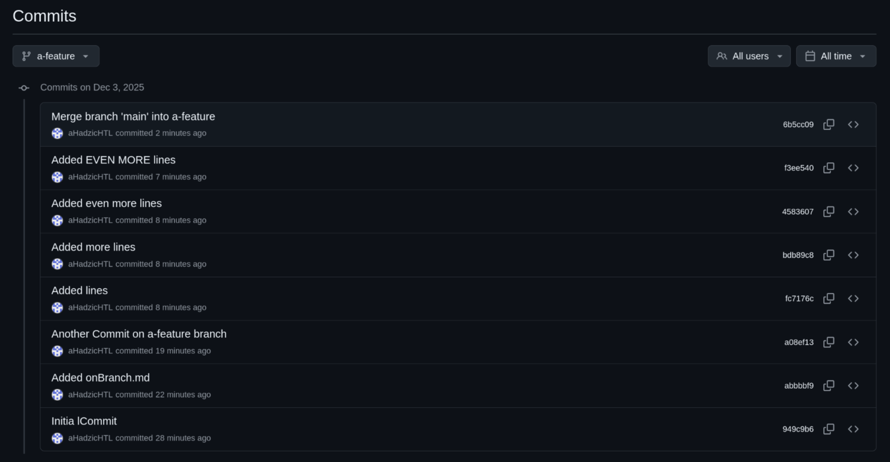

# Merging vs. Rebasing | Exercise

1. Create a repository, add a file onMain.md and commit

2. Create a branch a-feature, check it out, create a file onBranch.md and commit

3. Add some more lines to onBranch.md and commit

4. View and document the history

- Feature has the commit from main and two extra commits.

5. Switch back to main branch and view and document the history as well as the content of your repository.

- Main only has one commit.

6. Reflect and document: are there differences between the two histories and contents and why?

- Well the a-feature branch is 2 commits ahead of main.

7. Add some more lines to onMain.md and commit

8. Repeat the last step a few times (at least twice)

9. Document the history again

- The history of main after commiting again

10. Switch back to the feature branch

11. Merge the main branch into the feature branch
`git merge main`

- The a-feature branch now has the Changes of the main branch as well as his normal history. A new "merge commit" got created to connect the two branches
